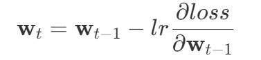

# 要点总结

## SoftMax 回归

- 虽然名字叫“回归”，但是本质上是个分类问题
- 分类是离散的回归 `ex. 回归问题：预测未来的价格。分类问题：判断是猫还是狗（2类分类）。`
- 只有两类分类：logistic 回归（T/F）

### 从回归过渡到分类

- 虚拟变量（独热编码）：将非数字分类转成数字
- 预测：最大似然估计 **对正确分类的估计概率应要远大于其它分类**
  - 即：正确分类要比错误分类在概率上有显著差异，不关心绝对值，仅关心相对值。
  - 所以，softmax 函数的输出应该是一组概率向量（如 ppt，作指数处理）：[p1, p2, ... pn]，一共 n 个分类，其中 pi 之和为 1，并且一定有某个 pi 显著大于其他，这个 pi 对应的分类 i 就是计算机预测的正确分类
  - 例如，有个三分类的问题，若真实分类为第二类（[0,1,0]），则 softmax 可以输出[0.1, 0.8, 0.1]，此时模型认为是第二类的概率比较大。
- 损失评判：交叉熵函数，一般用于概率比较

$$
H(\mathbf{p}, \mathbf{q}) = \sum_i -p_i \log(q_i)
$$

其中，pq 都是 n 维概率向量，并且 H(p,q) ≠ H(q,p)

- 依据刚刚的三分类问题，H = −(0⋅log(0.1)+1⋅log(0.8)+0⋅log(0.1)) = -log(0.8)

  - 这里也可以看出，取 log 之后，概率越接近 1，交叉熵损失越小

- 化简：

$$
l(\mathbf{y}, \hat{\mathbf{y}}) = -\sum_i y_i \log \hat{y}_i = -\log \hat{y}_i
$$

由于分类中，**yi 仅有一个 1**，其他都是 0，故可化简

梯度推导：

$$
\begin{align*}
l(\mathbf{y}, \hat{\mathbf{y}}) &= -\sum_i y_i \log \hat{y}_i \\
&= -\sum_i y_i \log \frac{\exp(o_i)}{\sum_j \exp(o_j)} \\
&= -\sum_i y_i (o_i - \log(\sum_j \exp(o_j))) \\
&= -\sum_i y_i o_i + \sum_i y_i \log(\sum_j \exp(o_j)) \\
&= - y_i o_i + \log(\sum_j \exp(o_j))
\end{align*}
$$

$$
\frac{\partial l(\mathbf{y}, \hat{\mathbf{y}})}{\partial o_i} = -y_i + \frac{\exp(o_i)}{\sum_j \exp(o_j)} = \text{softmax}(o_i) - y_i
$$

## 损失函数

loss，用于衡量真实值和预测值的区别，越小越好

- 均方损失：L2 loss
  - 有 1/2 是为了求导时方便约掉
  - 蓝色线是 y = 0 时，loss 关于 y' 的曲线
  - 绿色线是似然函数（正太分布）
    - 损失越小，似然函数越大，预测越“像”真实值
  - 橙色线是梯度，显然越靠近 O(0,0)越小，原离远点越大。所以越远离原点，调整幅度越大；越靠近原点，调整幅度越小。
- 绝对值损失：L1 loss
  - 梯度是稳定的，但是在原点处有剧烈变化，不平滑。所以不在原点附近时，都是以相同的幅度在调整模型参数，有良好的稳定性。
- 二者结合损失函数：Huber's Robust Loss
  - 如 ppt 的图，显然当预测值和真实值的差距比较小时，我们采用 L2 loss 来微调模型。反之我们用 L1 loss 来稳步调整模型。

### 理解梯度与学习率

学习率 lr 和梯度二者共同作用下降的步伐。其中，lr 只有大小，而梯度是向量。（梯度不是单位向量）
