# 导论——大语言模型介绍

## 历史

目前 AI 的应用：

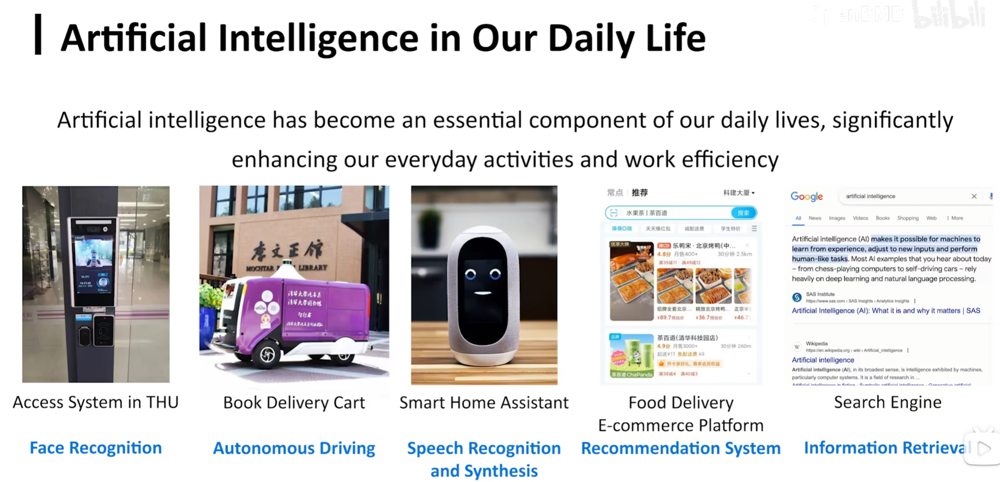

### definition

intelliengce exhibited by machines, particularly computer systems 即让计算机系统具备智能

阿兰·图灵

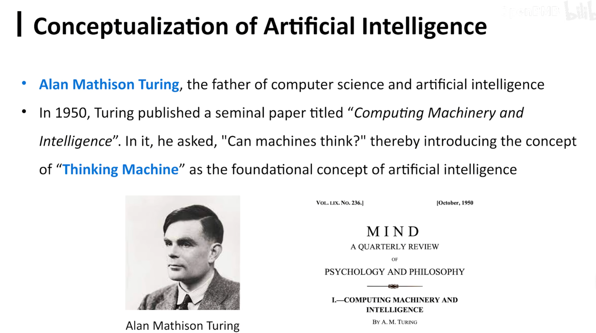

图灵测试：测试计算机是不是人，通过即认为计算机具备人的智能

### 发展

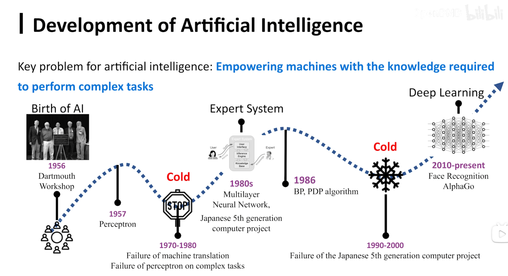

核心为：**knowledge**

#### 符号智能

相关领域的知识可以通过符号的形式写成一条条规则、知识，交由计算机运行

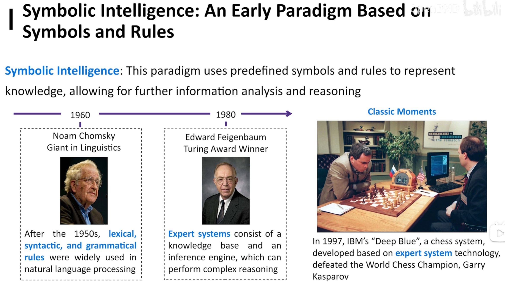

C++，python 都是符号的。当时的方案是由专家手工将某领域的知识描述出来。

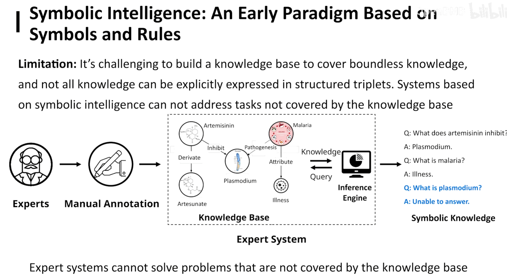

劣势：人脸识别、机器翻译。因为专家总结无法穷尽，且这些知识很难符号化表述。

#### 专用智能

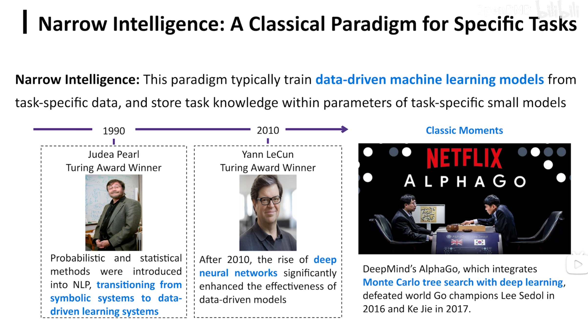

核心：**数据驱动、数据标注**

基本思路：先定义一个任务，再收集相关数据，然后通过机器学习的方式让计算机学习数据中的知识，学到知识的模型就可以作为专用模型完成任务。

初步的自动化知识提取方案：

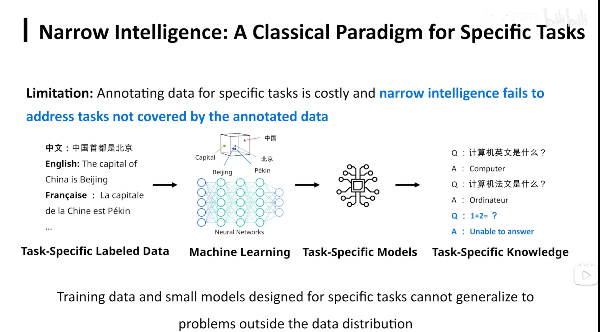

劣势：我们总是要先定义一个任务（如机器翻译），且模型只能做对应的任务，泛化能力差

#### 通用智能

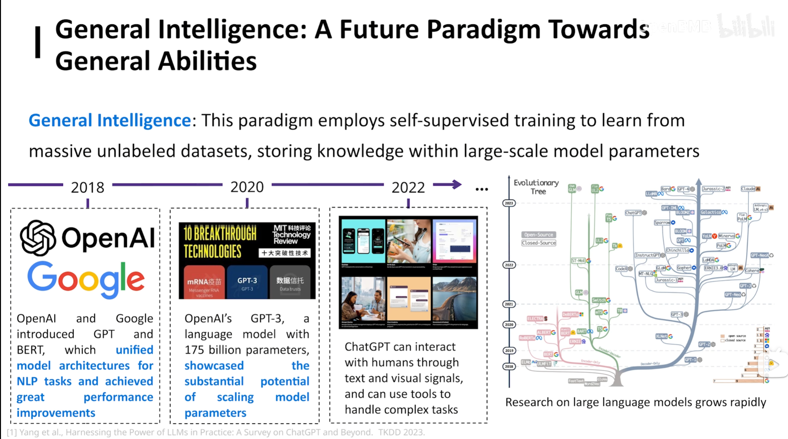

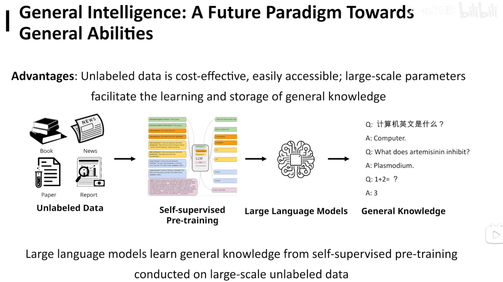

不再是学习某个具体任务的知识，而是从包罗万象的互联网学习，无需标注；只要用大模型本身**自监督**的功能学习即可。

**大模型的本质不是“大”，而是通用**

### 通往通用人工智能（AGI）的曙光

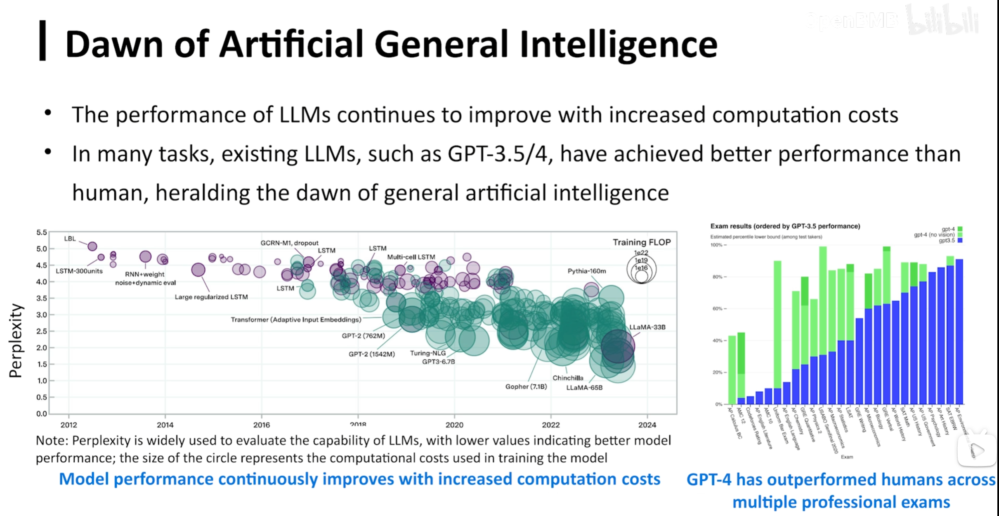

由上图，随着时间的推移，模型的 perplexity（困惑） 在逐渐降低。（perplexity 是评价模型建模能力的指标，越低越好）

scaling law：数据越多，模型越大，能力越强

#### definition

aritificial general intelligence 和人一样智能的计算机系统

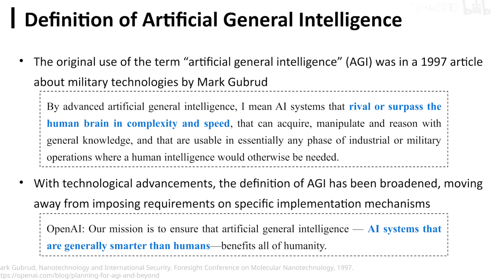
