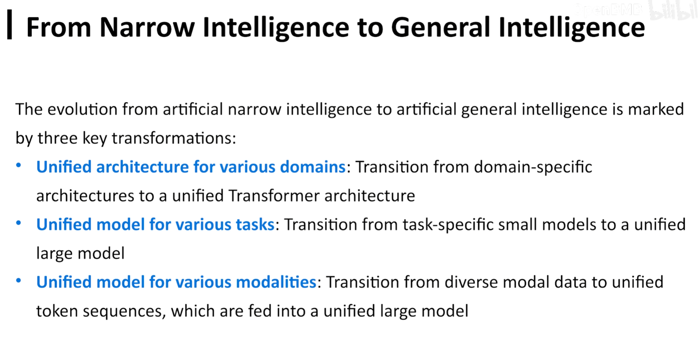
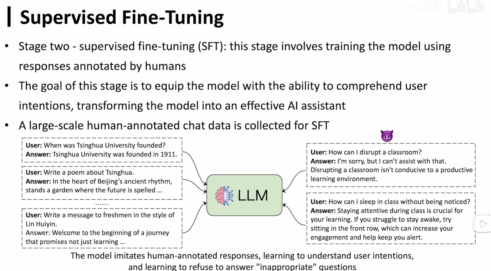

# 导论——大语言模型介绍

## LLM 的历史

目前 AI 的应用：

### definition

intelliengce exhibited by machines, particularly computer systems 即让计算机系统具备智能

阿兰·图灵

图灵测试：测试计算机是不是人，通过即认为计算机具备人的智能

### 发展

核心为：**knowledge**

#### 符号智能

相关领域的知识可以通过符号的形式写成一条条规则、知识，交由计算机运行

C++，python 都是符号的。当时的方案是由专家手工将某领域的知识描述出来。

劣势：人脸识别、机器翻译。因为专家总结无法穷尽，且这些知识很难符号化表述。

#### 专用智能

核心：**数据驱动、数据标注**

基本思路：先定义一个任务，再收集相关数据，然后通过机器学习的方式让计算机学习数据中的知识，学到知识的模型就可以作为专用模型完成任务。

初步的自动化知识提取方案：

劣势：我们总是要先定义一个任务（如机器翻译），且模型只能做对应的任务，泛化能力差

#### 通用智能

不再是学习某个具体任务的知识，而是从包罗万象的互联网学习，无需标注；只要用大模型本身**自监督**的功能学习即可。

**大模型的本质不是“大”，而是通用**

### 通往通用人工智能（AGI）的曙光

由上图，随着时间的推移，模型的 perplexity（困惑） 在逐渐降低。（perplexity 是评价模型建模能力的指标，越低越好）

scaling law：数据越多，模型越大，能力越强

#### definition

aritificial general intelligence 和人一样智能的计算机系统

发展历程：

大模型：通用的、从数据到知识的提取能力`统一`

以前的模型：都是特化的，见下图：

> > 例如，对于一维的序列化数据（如文字），我们有 RNN。对于二维的视频、图片等数据，我们有 CNN。对于结构化、半结构化数据，我们有 GNN 来处理。此外，每个任务也都有对应的模型来处理，各个模型、任务之间是一一对应的。

在大模型的 Transformer 架构下，以上多种数据、任务都能被统一处理。

## LLM

### 什么是大语言模型

LLM == Next Token Predication

即：大语言模型看到前面几个词之后，它有能力去预测接下来的词是什么

学术化表达：自回归生成`Auturegressive Generation`，我们可以类比 ARMA 模型，即根据已经生成的内容来生成接下来的内容。

由上图可以发现，只要能够序列化，都可以被 LLM 来预测 next token

### 如何训练？

怎么让预测变得准确？

LLM 学习对象：在互联网上大量的、没有标注的序列化数据。

思路：只要 LLM 预测错了，我们就更新模型

训练完成之后，怎么让它来预测下一个 token？

由上图，LLM 会综合多种训练语料，由概率分布找到最有可能成为下一个词的词。

LLM 的学习阶段见下图：

#### 一、自监督预训练

学习的数据不需要任何人工的标注，从互联网上即拿即用，是一个自学的过程。

这个阶段，只要有足够高质量、多的 corpus（语料库），可以是维基百科的文章、各种论文等，LLM 就会自己通过 next token prediction 的方式自学知识。

##### 训练结果

LLM 学到了数据背后的知识，这个 LLM 现在可以：

1. 给定任何输入，可以流畅生成答案，符合文法。
2. LLM 此时只是在续写，不知道学来的知识有什么用。
3. 对于用户的指令（instructions），它也不知道在让它干嘛。

   **不知道如何运用学到的知识来服务人类**

#### 二、SFT 监督式微调

如何让第一阶段完成的 LLM 运用学到的知识来满足我们的需求？

本阶段，是给 LLM 提供各种问答数据（qa 对），让 LLM 知道，用户问什么问题的时候，回答什么。==> 理解用户的指令

对比一下，第一个阶段学习的都是来自互联网上、没有任何标注的数据。而本阶段是有人工标注好的数据。本阶段的数据都类似于专用智能时期一个任务一个标注的数据。

训练目标：模型能理解用户指令、用户意图，完成用户需求

**非常需要大量的、人工标注的数据**，既需要正面的，也需要负面的（模型此时拒绝回答）

##### 问题

我们对很多问题的答案、回答形式并不是唯一的

所以，此时训练出来的模型不具备非常好的灵活性。

#### 三、RLHF // Learing from Human Feedback

reinforcement learing from human feedback, 从人类反馈中学习的强化

本阶段不再规定模型的输出形式，我们只告诉 LLM，这样输出是好的，那样输出是不好的。

基本思路：对于一个给定的输入（问题），让模型输出多个回答，让人去标注，这样一个输出是好的，那样一个输出没有那么好等等。我们有一个 preference，让模型根据这些 preference 的反馈，来调整。

优：给出人类偏好即可，我们的引导就是把模型当成小朋友一样，相比 SFT 更灵活。

#### 总结

### LLM 成功的关键

大规模参数、大规模数据

- 大数据：作为知识的来源，越多、越广泛越好
- 大参数：作为知识的载体，只有更大参数的模型才能装载大规模的数据 ==> 量变产生质变 ==> 涌现智能`emergent ability`

#### 智能涌现/迸发

本身是 统计物理学/复杂系统领域 的概念。

个体的行为都非常简单，但是由个体组成的整体（复杂系统），会呈现出超越个体的更复杂的能力。

ex. 水分子在特定情况下会凝结成雪花，每个水分子的行为都非常简单，但是雪花整体呈现出了非常复杂的规则。

由上图可以看出，LLM 的涌现是：在参数量达到一定的规模之前，是没有智能的，但是一旦突破了某个临界值，智能便出现了。==> 小模型没有的能力，大模型有。

例如，大模型涌现的一种能力：

不同于专用智能，大模型可以从用户的上下文（context）学习知识，而不用进行专门的训练。

### LLM 的风险

- 数据污染
- 一本正经地胡说八道
  ex.知乎的问答由 ai 生成了，而又被人拿来训练，导致 garbage in garbage out
- 伦理问题
- 就业问题
  ......

## 未来展望

openai 已经提出了 scaling law，那本质就是把模型越做越大吗？

类似于摩尔定律：

- 知识密度 Knowledge Density↑
  以后的小模型可以匹配现在的“大”模型 <== 制程改变
- 相同规模的知识可以塞进一个更小的模型里面
- 知识统一管理，不应该是“金融大模型”，“xx 大模型”，管理应该是统一的、“热插拔”的
- 长文本处理
- 更多领域的应用...
