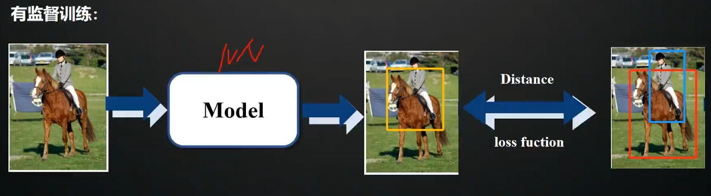
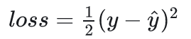
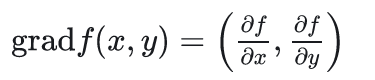
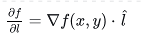
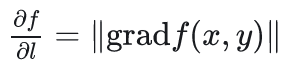
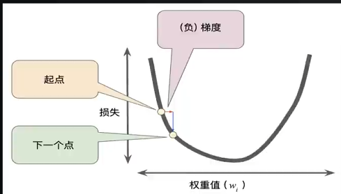
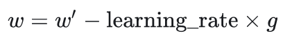
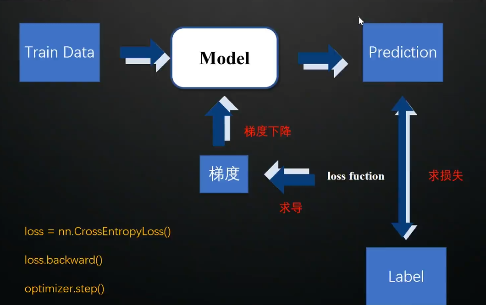

# 深度学习模型

## 有监督训练

### 例子

上例中，`MODEL`就是一个`NN` 
一开始，所有的参数都是随机数，那么此时模型是没有对特征提取的能力的，效果非常差 
有监督训练可以类比<i>学生考试</i>：学生每次写完答案后，都要和标准答案比对。此时分数就是一个对学习成果的表征，并且可以反映哪里学的不好，之后可以向这个方向努力 
模型也是一样的，模型在训练时，不仅仅有数据，还有对应于不同数据的真值。真值的设计是和不同任务相关的。在本例图像识别中，真值就是识别出“人在马上”。而在分割任务中（还是以本例的图为基准），真值就是“人马共同体”在图片中的边界。 
模型会根据自己的参数计算，给出`prediction`（学生考试的答案），一开始由于全是随机数所以肯定不准。此时我们需要比对`prediction`和数据真值之间的距离`distance`，<b>训练的目的就是尽可能减小`distance`</b>。只有当二者的距离足够小时，我们才能说模型的预测值和实际是无限接近的。 

### 损失函数 `loss function`

类似于计量经济学，我们有

其中， `y` 表示模型的预测值， `y^` 表示真值

==> 接下来转化为数学问题：<i>我们怎么求`loss`的最小值？</i>

## 梯度下降算法

### 梯度

概念：是一个矢量，其方向上的方向导数最大，其大小正好是此最大方向导数。

对于在平面区域 $D$ 上具有一阶连续偏导数的二元函数 $f(x,y)$，我们可以在每一个点 $P(x,y)$ 定出一个向量，这个向量称为函数在点 $P$ 的梯度，记作 $\mathrm{grad} f(x,y)$ 或 $\nabla f(x,y)$，其表达式为：

其中 $\frac{\partial f}{\partial x}$ 和 $\frac{\partial f}{\partial y}$ 分别是 $f(x,y)$ 对 $x$ 和 $y$ 的偏导数。

设 $\hat{l}$ 是方向 $l$ 上的单位向量，则方向导数可以表示为：

由于当方向 $l$ 与梯度方向一致时，即 $\hat{l} = \frac{\mathrm{grad} f(x,y)}{\left\| \mathrm{grad} f(x,y) \right\|}$，有：

所以，当 $l$ 与梯度方向一致时，方向导数达到最大值，且最大值为梯度的模，即函数在一点沿梯度方向的变化率最大，最大值为该梯度的模。

### 例子

在上例中，我们需要找到整个函数的最低点，使用梯度下降算法。 
由于梯度下降最快，所以我们可以逆着梯度找到最低点。（本例中梯度是指向增长方向的） 
权重（或偏移）因此可以更新：

其中：`w'`是`t-1`时刻的参数，`learning_rate`是学习率，`g`是梯度，即对`loss`的求导。 
即表达：逆着梯度走，接近最小损失率 
学习率控制参数更新的快慢 
而由上图函数形式，很容易发现可能会陷入“循环陷阱”，即在`loss`最低处来回摆动，但是不能接近`loss min`，此时需要调整学习率

[实例讲解](https://www.zhihu.com/question/270562234/answer/3175049536)

## 神经网络训练 pytorch api

首先，加载训练数据集`DataLoader` + 符合 api 规则

其次，用`nn.model`进行模型的搭建

接着，求损失函数。之前我们讲的是

这是均方误差 MSE 损失函数。实际上，还能有不同种类的损失函数，我们需要调用不同的 api

对损失函数求导`loss.backward()`

梯度下降更新参数`optimizer.step()`
